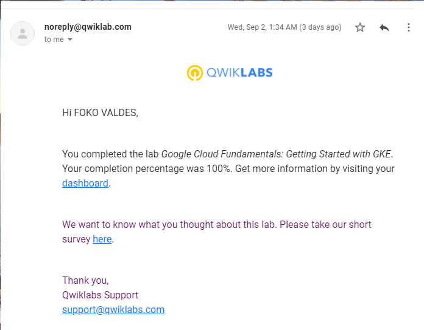

# Google Africa Developer Scholarship preparatory project

This practice project documents laboratory work done on [qwiklabs](https://www.qwiklabs.com/) for Google Africa Developer Scholarship, a joined program between [Andela](http://andela.com/) and [pluralsight](http://pluralsight.com/) to train African Tech ecosystem in-high demand technologies. The current documentation is for Google Cloud Platform(GCP) training. 

The first 3 labs have full code documentations alongside them with prove of lab completion while the others have just prove of lab completion.

#### N.B. All lab names represent actual names in pluralsight platform. Links to them require a subscription on [pluralsight website](http://pluralsight.com/)

## Contents

### Lab 1: Console and cloud shell
[Console & Shell translation](screenshots-and-documentation/screenshots/lab1_readme.md)

### Lab 2: Working with Virtual Machines
_Working with Virtual Machines Translation_: screenshots-and-documentation/screenshots/lab2_readme.md

### Lab 3: Creating Virtual Machines
_Creating Virtual Machines Translation_: screenshots-and-documentation/screenshots/lab3_readme.md

### Lab 4: Cloud IAM

### Lab 5: Cloud SQL

### Lab 6: Cloud Storage

### Lab 7: Examining Billing data with bigquery

### Lab 8: Getting Started with App Engine

### Lab 9: Getting Started with Bigquery

### Lab 10: Getting started with cloud storage and cloud sql

### Lab 11: Getting Started with compute engine

### Lab 12: Getting Started with GKE

### Lab 13: Implementing Private google access and Cloud NAT

