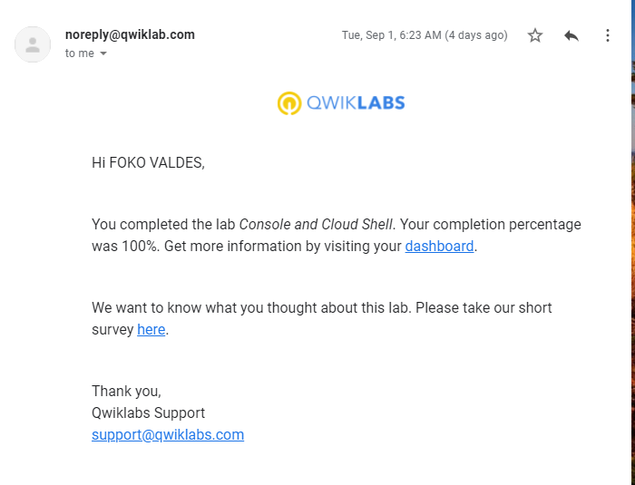

# Lab 1 write-up

## Console and Cloud Shell

### Task 1 : Get access to Google Cloud.
 From command line(Windows), BASH(linux), run  the following command to initialize gcloud and  press Y to login when prompted. 

 `gcloud init`

### Task 2 : Create a Cloud Storage bucket using the Cloud Console. (command line version)
This command creates a bucket in US multi-region with Standard storage class

`gsutil mb -l US gs://gads-lab-1`

### Task 3 : Create a second Cloud Storage bucket using Cloud Shell.

`gsutil mb gs://gads-lab-test`

### Task 4: copy a file called `credentials.json` from working directory to second bucket
`gsutil cp credentials.json gs://gads-lab-test`

### Task 5: Create a persistent state in Cloud Shell
- Create Environment variable for Region
`export INFRACLASS_REGION=us-central1`

- Create a new directory and a file for configuration

`mkdir infraclass`

`touch infraclass/config`

- Append region environment variable to config file

`echo INFRACLASS_REGION=$INFRACLASS_REGION >> ~/infraclass/config`

- Create Environment variable for project
`export INFRACLASS_PROJECT_ID=my-project-version-9874`

- Append project environment variable to config file
`echo INFRACLASS_PROJECT_ID=$INFRACLASS_PROJECT_ID >> ~/infraclass/config`

- set the environment variables
`source infraclass/config`

#### Test: close shell, reopen and test to see if environment variables are maintained.
`exit`

`echo $INFRACLASS_PROJECT_ID`

- Edit .profile file by adding this at end of file content
`source infraclass/config`

#### Completion of the lab produced the following result. 
