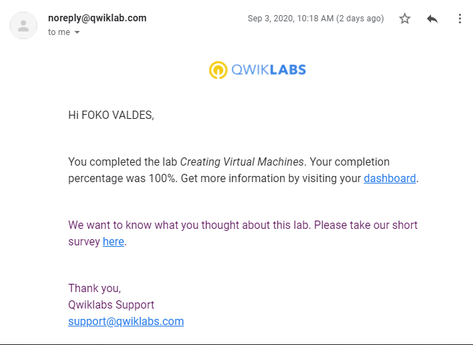

# Lab 3 write-up

## Creating Virtual Machines

### Task 1 : Get access to Google Cloud.
 From command line(Windows), BASH(linux), run  the following command to initialize gcloud and  press Y to login when prompted. 

 `gcloud init`

### Task 2 : Create a utility virtual machine using the Cloud Console. (command line version)
This command creates a VM called instance-one in us-central1 region us-central1-a zone with default service account with scopes: default  ;with image debian 9 stretch 2020 edition, boot disk space 10GB
  
`gcloud beta compute instances create intance-one --zone=us-central1-c --machine-type=n1-standard-1 --subnet=default --no-address --service-account=177933280036-compute@developer.gserviceaccount.com --scopes=default --image=debian-9-stretch-v20200902 --image-project=debian-cloud --boot-disk-size=10GB --boot-disk-type=pd-standard --boot-disk-device-name=intance-one --reservation-affinity=any
`

- Command reads 20 log entries from compute engine instances
` gcloud logging read "resource.type=gce_instance" --limit=20`

### Task 3 : Create a Windows Virtual machine
This command creates a VM called instance-two in europe-west2 region europe-west2-a zone with default service account with scopes: default ; with tags http-server https-server, image windows-server 2016 core edition, boot disk space 100GB SSD

`gcloud beta compute instances create intance-two --zone=europe-west2-a --machine-type=n1-standard-1 --subnet=default --service-account=177933280036-compute@developer.gserviceaccount.com --scopes=default --tags=http-server,https-server --image=windows-server-2016-dc-core-v20200813 --image-project=windows-cloud --boot-disk-size=100GB --boot-disk-type=pd-ssd --boot-disk-device-name=intance-two --no-shielded-secure-boot --shielded-vtpm --shielded-integrity-monitoring --reservation-affinity=any`

- Command creates firewall rule called default-allow-http to allow incoming tcp connections on port 80 for all IP addresses with target tags https-server

`gcloud compute firewall-rules create default-allow-http --direction=INGRESS --priority=1000 --network=default --action=ALLOW --rules=tcp:80 --source-ranges=0.0.0.0/0 --target-tags=http-server`

- Command creates firewall rule called default-allow-https to allow incoming tcp connections on port 443 for all IP addresses with target tags https-server
`gcloud compute firewall-rules create default-allow-https --direction=INGRESS --priority=1000 --network=default --action=ALLOW --rules=tcp:443 --source-ranges=0.0.0.0/0 --target-tags=https-server
`

- create a password for windows server
`gcloud compute reset-windows-password instance-two --zone=europe-west2-a`

### Task 4: Create a custom virtual machine
This command creates a VM called custom in us-west1 region, us-west1-a zone, with default service account and scopes: default  ;with image debian 9 stretch 2020 edition, boot disk space 10GB; machine type=e2-custom 6GHz CPU 32 GB RAM

`gcloud beta compute instances create custom --zone=us-west1-b --machine-type=e2-custom-6-32768 --subnet=default --service-account=177933280036-compute@developer.gserviceaccount.com --scopes=default --image=debian-9-stretch-v20200902 --image-project=debian-cloud --boot-disk-size=10GB --boot-disk-type=pd-standard --boot-disk-device-name=custom --reservation-affinity=any
`

#### Test: open ssh and run the follow commands to: 
- see free space remaining
`free`

- see details about RAM installed in VM
`sudo dmidecode -t 17`

- verify number of processors
`nproc`

- see details about cpu installed on  VM
`lscpu`

#### Completion of the lab produced the following result. 

